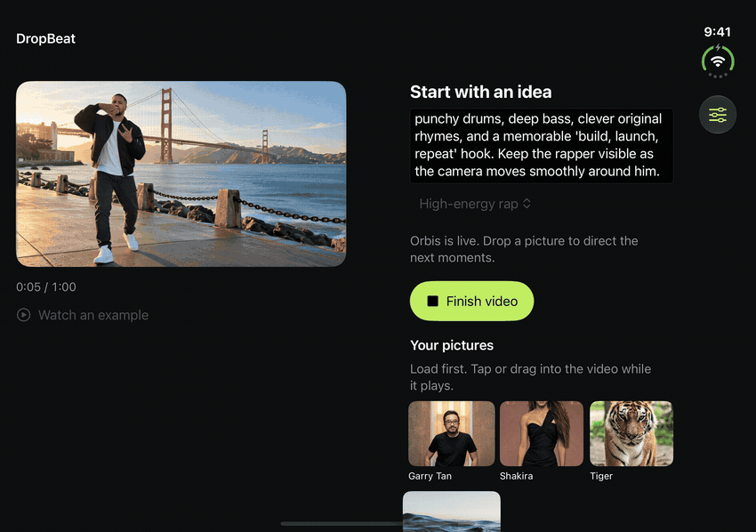
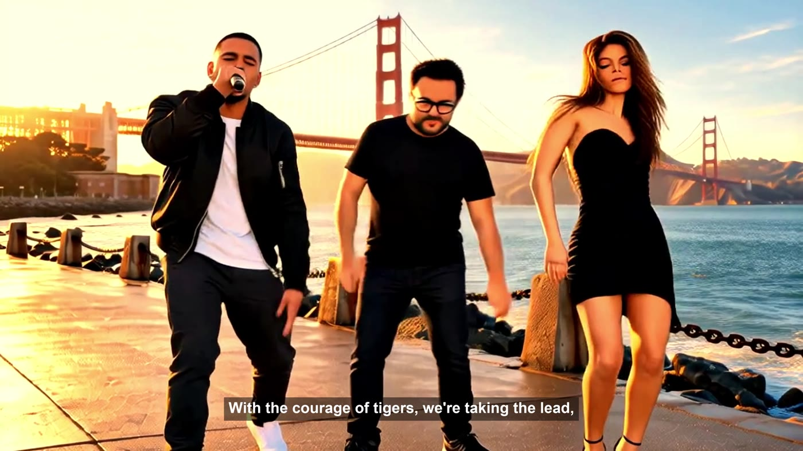
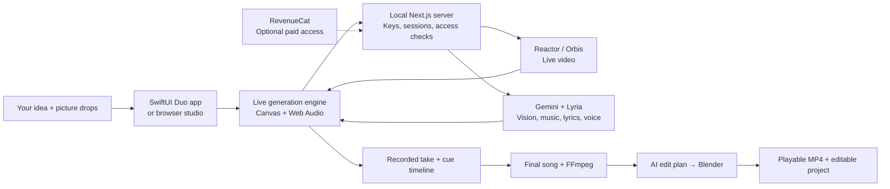

<div align="center">

# DropBeat

### Drop a picture. Direct the beat.

**Direct an AI music video while it is being created.**

Start with an idea. Drop in a picture. Steer the scene, the beat, and the next rap lines.

[See it in action](#your-pictures-become-directions) · [Run locally](#run-locally) · [How it works](#how-it-works) · [Contribute](CONTRIBUTING.md)


[](LICENSE)

[](#your-pictures-become-directions)

</div>

## Your pictures become directions

Most video tools ask you to describe everything before you see anything. DropBeat gives you a scene to react to. Bring in a tiger, change the setting to the ocean, or type a new direction while the music plays.

The interface stays simple: **one opening idea, your pictures, and a playing video.** Load pictures first; they enter the scene only when you tap or drag them into the video.



*Real simulator capture. “Accepted” means the model received the direction; the visual change follows afterward.*

## One minute, your direction

1. **Start with a scene.** “An original rapper performs in San Francisco, rapping about founders who build, launch, and repeat.”
2. **Drop in your pictures.** Add people, subjects, locations, or atmosphere while it plays. Type a direction whenever you want.
3. **Hear it react.** The instrumental responds to the direction, and original English spoken-rap phrases follow the current scene.
4. **Finish and share.** Generate the final vocal track, apply an AI-directed Blender edit, then watch or save the MP4.

| What you can do | What happens |
| --- | --- |
| Preload pictures | Import with native Photos, Files, or the Mac picker in Simulator. |
| Drag or tap during playback | Receive visible feedback: received, accepted, or failed. |
| Change the scene in words | Steer visuals and musical direction without opening an editor. |
| Hear live vocals | Stream reactive spoken rap over the instrumental. |
| Refine with AI + Blender | Ask for an edit in plain English; a bounded edit plan controls colour, motion, and captions. |
| Keep editing elsewhere | Export the video, soundtrack, lyrics, scene directions, and Blender project. |
| Try before connecting providers | Play the bundled example; the browser also has a local preview when keys are absent. |

## See the result

[](https://github.com/KaushikSiva/Dropbeat/releases/download/v0.1.0/DropBeat-YC-MusicVideo-4K.mp4)

**[Record your own walkthrough](docs/DEMO.md)** — opening prompt, drag sequence, and a ready-to-use Indian-English voice-over.

**[Standalone music video · 1:00](https://github.com/KaushikSiva/Dropbeat/releases/download/v0.1.0/DropBeat-YC-MusicVideo-4K.mp4)** — original YC rap, English captions, and an AI/Blender finish.

The demo separates actual live capture from the final edit. The live model did not reliably preserve likenesses or complete every visual change within the minute, so the finished video includes additional AI scene inserts. The music video is a 4K export with upscaled generated footage. The people shown are visual references; the original vocals do not imitate their voices. See [demo notes](docs/DEMO.md).

## Run locally

### 1. Get the studio running

You need **Node.js 22.13+ LTS or 24+ LTS**. Live generation needs a **Reactor/Orbis API key** and a **Gemini API key with access to the configured music, text, and speech models**. Blender and FFprobe are needed for the finishing workflow.

```bash
git clone https://github.com/KaushikSiva/Dropbeat.git
cd Dropbeat/studio
npm ci
cp .env.example .env.local
```

Add your own keys to `studio/.env.local`, then:

```bash
npm run dev
```

Open **http://127.0.0.1:3211**. You can inspect the interface and watch the example without API keys. Generation calls use your provider account and may incur charges.

For finishing on macOS, install [Blender](https://www.blender.org/download/) and FFmpeg/FFprobe (`brew install ffmpeg`). If they are installed elsewhere, set `BLENDER_PATH` and `FFPROBE_PATH` in `.env.local`.

### 2. Open the native app

The native target uses the **Xcode 27.1 / iOS 27.1 Duo SDK**, including `ArrangementView`. A runtime fallback adapts to older iOS versions, but compilation still requires a toolchain that provides that API. This is the [Bitrig Duo development environment](https://bitrig.com/blog/iphone-duo-app-development) used for the demo.

Stop the manually started server with **Ctrl-C** before letting Xcode start its simulator server.

```bash
cd ..
open MusicVideo.xcodeproj
```

Select **MusicVideo → iPhone Duo → Run**. The scheme starts the included local server automatically after `npm ci`. No sibling Kriya repository is required.

Use the prompt field’s **Paste** and **Copy** controls to enter or reuse your idea. **Photos** and **Files** import into the app's picture library. **From Mac** opens a native Mac picker when running in Simulator. In **Advanced**, the simulator address is `http://127.0.0.1:3211`.

The native app keeps provider credentials on the Mac. To configure them visually, open the browser studio’s **Advanced** panel. RevenueCat is optional for local use. See [setup and troubleshooting](docs/SETUP.md).

## How it works



**SwiftUI** owns the native layout, imports, drag/drop, playback, and sharing. A small **WKWebView** runs the JavaScript video/audio engine required by the Orbis SDK. It is a native interface with a web media engine, rather than an entirely Swift generation stack.

**Next.js** holds provider keys, creates short-lived video tokens, streams music and voice, and saves takes. **FFmpeg** prepares exports. **Blender** executes a validated JSON edit plan through a trusted Python renderer; the model does not supply executable Python. **RevenueCat** supplies optional checkout and entitlement checks.

[Explore the architecture and source map →](docs/ARCHITECTURE.md)

## Project layout

```text
Dropbeat/
├── MusicVideo.xcodeproj/      Native app and shared Xcode schemes
├── Sources/                  SwiftUI, imports, drops, and web bridge
├── Resources/                Bundled pictures and offline example
├── Tests/                    Native UI tests
├── studio/
│   ├── app/create/music-video/
│   │   ├── _components/      Browser studio
│   │   ├── _lib/             Engine, audio, billing, and Blender
│   │   ├── native/           WKWebView generation surface
│   │   └── api/              Generation and export routes
│   ├── scripts/              Xcode's local-server launcher
│   └── tests/                Direction and edit-plan checks
└── docs/                     Setup, architecture, and demo media
```

## Current boundaries

- **Live vocals are reactive spoken rap**, with generation delay. The polished vocal performance is generated after the take; this is not continuous live singing.
- Visual changes are probabilistic and may lag. A successful drop does not guarantee immediate insertion or an exact likeness.
- This is a **local-first prototype**, validated in the Duo simulator. Physical-device deployment and a production multi-user service are not validated.
- Keep the app open during generation and refinement. Model availability and account access affect live features.
- Generated takes and credentials stay out of Git. Provider requests do send prompts, pictures, and relevant media to the selected services.

## Build with us

Good first contributions: improve generation recovery, tighten lyric timing, add cue history and undo, test on physical devices, or make a new music style feel great.

```bash
cd studio
npm test
npm run typecheck
npm run lint
npm run build
```

Native checks live in **Product → Test**. The **MusicVideoLive** scheme opts into a paid generation integration test; do not use it for routine checks.

Read [CONTRIBUTING.md](CONTRIBUTING.md), [report a bug](https://github.com/KaushikSiva/Dropbeat/issues/new?template=bug_report.yml), or [suggest an idea](https://github.com/KaushikSiva/Dropbeat/issues/new?template=feature_request.yml).

If this is the kind of creative tool you want to exist, **star the repo** and help shape its next scene.

---

Built by [Kaushik Siva](https://github.com/KaushikSiva). Extracted from Kriya as a standalone app and studio. Code is [MIT licensed](LICENSE); third-party tools, services, and media retain their own terms. [Credits →](docs/CREDITS.md)
