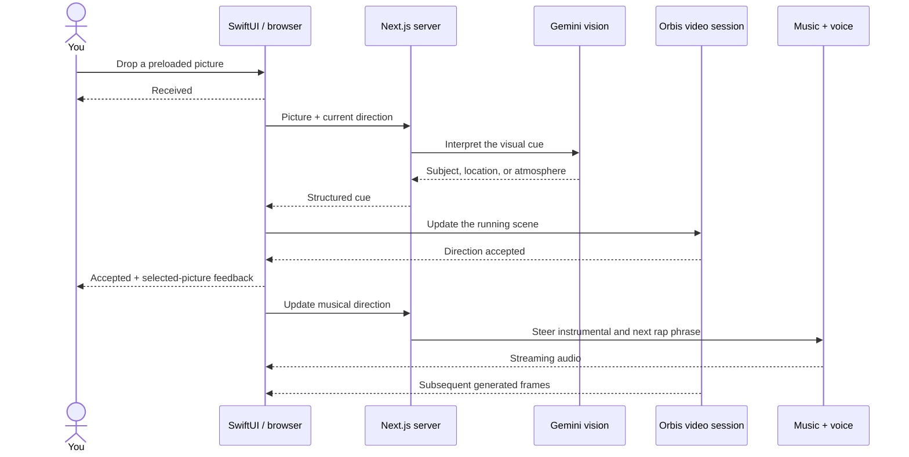

# How DropBeat works

DropBeat has two front ends and one generation engine. The SwiftUI app gives Duo a native interface; the browser studio makes the same workflow available on the Mac. Both use the included Next.js server.

## Follow one picture

Pictures are loaded into a library before the take. Loading does not trigger insertion. The drop/tap event introduces the cue. A subject cue aims to preserve the setting; a location cue explicitly permits a transition. Acceptance is a control acknowledgement, not proof that a subject has appeared in the pixels.

## Components

| Layer | Responsibility | Start reading |
| --- | --- | --- |
| SwiftUI | Duo layout, native import, picture library, playback and sharing | [`MusicVideoApp.swift`](../Sources/MusicVideoApp.swift) |
| Native bridge | WKWebView commands, status events, native drop handling | [`Studio.swift`](../Sources/Studio.swift) |
| Web stage | Connect native commands to the shared engine | [`native/stage.tsx`](../studio/app/create/music-video/native/stage.tsx) |
| Media engine | Orbis session, canvas capture, Web Audio mix, cue steering | [`engine.ts`](../studio/app/create/music-video/_lib/engine.ts) |
| Instrumental | Lyria live session and prompt weighting | [`music-server.ts`](../studio/app/create/music-video/_lib/music-server.ts) |
| Live voice | Generate two English lines, stream spoken-rap audio | [`vocals-server.ts`](../studio/app/create/music-video/_lib/vocals-server.ts) |
| Access | Local settings, signed session cookie, optional entitlements | [`server.ts`](../studio/app/create/music-video/_lib/server.ts) |
| Final song | Generate the polished vocal performance and prepare audio | [`song.ts`](../studio/app/create/music-video/_lib/song.ts) |
| Refinement | Validate an AI edit plan and invoke a trusted renderer | [`refinement-plan.ts`](../studio/app/create/music-video/_lib/refinement-plan.ts), [`blender-render.py`](../studio/app/create/music-video/_lib/blender-render.py) |

## Audio has two phases

**During the take:** live instrumental generation is mixed with streamed, original spoken-rap phrases. Picture/text cues steer upcoming music and phrases. The current phrase may finish first, and generation adds latency.

**After the take:** the final song is generated separately. FFmpeg combines it with the recorded video. Gemini proposes a bounded Blender edit, including timed English captions. Blender renders the result and saves an editable `.blend` project. This is not continuous live singing, nor automatic frame-perfect lip sync.

## Data and trust boundaries

- Provider secrets come from `studio/.env.local` or the local Advanced settings file. They are excluded from Git.
- The video engine gets a short-lived Reactor session token; the long-lived provider key remains server-side.
- The Mac stores takes and exports under `studio/data/` unless `REPROCLIP_DATA_ROOT` points elsewhere. Browser library data also uses IndexedDB; native pictures live in the app’s Documents directory.
- Prompts, selected pictures and generation requests go to the chosen cloud providers. Blender and FFmpeg execute locally.
- Session cookies are signed, export routes check ownership, and mutating routes check origins. The Mac picker exposes only a user-selected file through a short-lived ticket.
- The AI returns JSON edit parameters, never executable Python. The renderer clamps effects and caption timing before rendering.
- The included launcher binds to loopback. Treat this as a single-user local prototype: public hosting requires a separate review of authentication, host validation, quotas, job isolation and storage.

## RevenueCat

The browser checkout uses `@revenuecat/purchases-js`; the backend checks the `music_video_pro` entitlement for non-local generation. Local bring-your-own-key access does not require a purchase. The native SwiftUI shell does **not** currently implement StoreKit purchases. The integration is present; App Store subscription shipping is not claimed.

## Why some names still say Kriya

DropBeat was extracted from Kriya’s music-video add-on. Internal route names, bundle identifiers, environment-variable names, and some storage identifiers remain for compatibility. The repository contains the backend it needs and has no runtime dependency on the original Kriya checkout.
