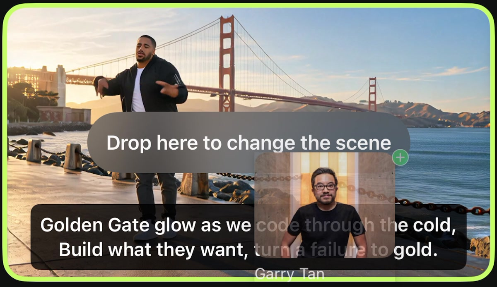
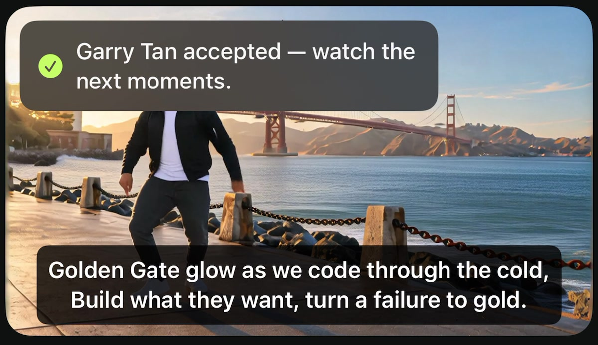

# Drag a picture into a live scene

These clips show actual recorded app interactions in the Duo Simulator. They are not animated interface mockups.

## 1. Hold the picture, then drag it onto the video

The source picture starts in the library on the right. During the drag, its floating thumbnail moves across the screen. When it reaches the video, the target gets a green outline and displays “Drop here to change the scene.”

## 2. Look for the drop target

This is a close-up frame from the recording. The floating picture, green plus and target highlight are produced by the app and operating system.

## 3. Wait for the result of the direction request

After release, the feedback progresses from received to accepted, or displays an error. The picture also gets a status indicator in the library. Acceptance acknowledges the direction request; visible generation can lag or fail to depict the intended subject.

## A second example: tiger

## How these clips were edited

- Source: the actual native app recording used for the original demo, captured on 26 September 2026.
- Garry drag begins around 00:45 in that recording; acceptance appears around 00:53.5.
- Tiger drag begins around 01:15; acceptance appears around 01:19.7.
- The gesture is slowed to 0.4× speed, and the frame is cropped to make the library and target easier to see.
- The provider wait between received and accepted is shortened. Labels outside the recorded interface explain these edits.
- The screenshots are crops of actual recorded frames. No cursor, floating picture, target highlight, status badge or successful generation was added in post-production.

Load pictures before starting. Loading alone does not introduce them into the scene. Once the video is running, either drag a picture onto it or tap a picture to send the direction.
